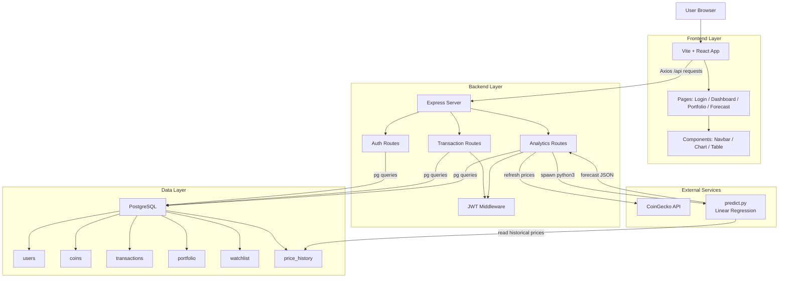

# Crypto Analytics


Crypto Analytics is a full-stack cryptocurrency portfolio tracking and forecasting project.

The project keeps the architecture intentionally simple:

- React frontend for the dashboard and portfolio UI
- Express backend for APIs
- PostgreSQL for data storage
- JWT authentication
- Python Linear Regression forecasting using `scikit-learn`

The goal of this project is not to be over-engineered. It uses a small number of files and a straightforward structure so the full application is easy to understand.

## Preview


## Features

- User registration and login
- JWT-based protected APIs
- Create, view, and delete transactions
- Portfolio tracking
- Portfolio analytics
- Watchlist management
- Coin price refresh using CoinGecko
- Forecasting with historical data from PostgreSQL
- Automated backend tests

## Tech Stack

### Frontend

- React
- Vite
- Tailwind CSS
- Axios
- Recharts
- React Router

### Backend

- Node.js
- Express.js
- `pg`
- JWT
- bcrypt

### Database

- PostgreSQL
- Raw SQL only

### Forecasting

- Python
- psycopg2
- scikit-learn
- Linear Regression

## System Architecture



## How the App Works

### 1. Authentication

- A user registers or logs in from the frontend
- The backend stores hashed passwords using `bcrypt`
- On successful login, the backend creates a JWT token
- The frontend stores the token in `localStorage`
- Protected requests send the token in the `Authorization` header

### 2. Transactions

- A user adds a `buy` or `sell` transaction
- The transaction is stored in the `transactions` table
- After that, the backend recalculates the current holding in the `portfolio` table

### 3. Analytics

- The backend reads data from `portfolio`, `transactions`, `coins`, and `watchlist`
- SQL queries use `JOIN`, `SUM`, `AVG`, `COUNT`, and `GROUP BY`
- The frontend shows the results as cards, tables, and charts

### 4. Forecasting

- The frontend requests forecast data for a selected coin
- The Express backend runs `forecast/predict.py`
- The Python script reads `price_history` from PostgreSQL
- It converts dates into numbers
- It trains a Linear Regression model
- It returns historical data and predicted prices as JSON

## Folder Structure

```text
Crypto Analytics/
├── backend/
│   ├── analytics.js
│   ├── auth.js
│   ├── db.js
│   ├── middleware.js
│   ├── server.js
│   └── transactions.js
├── database/
│   ├── sample_data.sql
│   └── schema.sql
├── forecast/
│   └── predict.py
├── frontend/
│   ├── index.html
│   └── src/
│       ├── App.jsx
│       ├── api.js
│       ├── index.css
│       ├── main.jsx
│       ├── components/
│       │   ├── Chart.jsx
│       │   ├── Navbar.jsx
│       │   └── Table.jsx
│       └── pages/
│           ├── Dashboard.jsx
│           ├── Forecast.jsx
│           ├── Login.jsx
│           └── Portfolio.jsx
├── tests/
│   └── backend.test.js
├── package.json
├── postcss.config.cjs
├── tailwind.config.cjs
└── vite.config.js
```

## Important Files Explained

### Backend

- `backend/server.js`
  - Creates the Express app
  - Connects all route files
  - Exposes health check and coin list routes
  - Serves the built frontend in production

- `backend/db.js`
  - Creates the PostgreSQL connection pool using `pg`
  - Every backend file reuses this same pool

- `backend/auth.js`
  - Handles register and login
  - Hashes passwords
  - Returns JWT tokens

- `backend/transactions.js`
  - Handles transaction APIs
  - Updates the `portfolio` table after each buy or sell

- `backend/analytics.js`
  - Handles portfolio summary, allocation, watchlist, monthly investment, top performer, and forecast endpoints

- `backend/middleware.js`
  - Checks JWT tokens on protected routes

### Database

- `database/schema.sql`
  - Creates all tables and indexes

- `database/sample_data.sql`
  - Inserts demo user, coins, transactions, portfolio data, watchlist data, and price history

### Forecast

- `forecast/predict.py`
  - Reads historical prices from PostgreSQL
  - Trains a Linear Regression model
  - Predicts prices for 1, 2, 3, and 5 years

### Frontend

- `frontend/src/App.jsx`
  - Defines page routes and protected routes

- `frontend/src/api.js`
  - Creates the Axios instance
  - Automatically sends JWT token with requests

- `frontend/src/pages/Login.jsx`
  - Login and register UI

- `frontend/src/pages/Dashboard.jsx`
  - Main analytics dashboard

- `frontend/src/pages/Portfolio.jsx`
  - Transaction form and portfolio tables

- `frontend/src/pages/Forecast.jsx`
  - Historical chart and forecast results

## Database Schema

The project uses these tables:

- `users`
- `coins`
- `transactions`
- `portfolio`
- `watchlist`
- `price_history`

### Table Purpose

- `users`
  - Stores user name, email, and password hash

- `coins`
  - Stores coin name, symbol, CoinGecko ID, and latest price

- `transactions`
  - Stores all buy and sell activity

- `portfolio`
  - Stores the latest calculated holding for each user and coin

- `watchlist`
  - Stores the user’s saved coins

- `price_history`
  - Stores historical daily prices used for charts and forecasting

## API Endpoints

### Public

- `GET /api/health`
- `GET /api/coins`
- `POST /api/auth/register`
- `POST /api/auth/login`

### Protected

- `GET /api/transactions`
- `POST /api/transactions`
- `DELETE /api/transactions/:id`
- `GET /api/analytics/summary`
- `GET /api/analytics/portfolio`
- `GET /api/analytics/allocation`
- `GET /api/analytics/top-performing`
- `GET /api/analytics/monthly-investment`
- `GET /api/analytics/watchlist`
- `POST /api/analytics/watchlist`
- `DELETE /api/analytics/watchlist/:coinId`
- `POST /api/analytics/refresh-prices`
- `GET /api/analytics/forecast/:coinId`

## API Examples

### Register

```bash
curl -X POST http://localhost:5050/api/auth/register \
  -H "Content-Type: application/json" \
  -d '{
    "name": "Test User",
    "email": "test@example.com",
    "password": "password123"
  }'
```

### Login

```bash
curl -X POST http://localhost:5050/api/auth/login \
  -H "Content-Type: application/json" \
  -d '{
    "email": "demo@example.com",
    "password": "password123"
  }'
```

### Get Transactions

```bash
curl http://localhost:5050/api/transactions \
  -H "Authorization: Bearer YOUR_JWT_TOKEN"
```

### Create Transaction

```bash
curl -X POST http://localhost:5050/api/transactions \
  -H "Content-Type: application/json" \
  -H "Authorization: Bearer YOUR_JWT_TOKEN" \
  -d '{
    "coin_id": 1,
    "transaction_type": "buy",
    "quantity": 0.02,
    "price_usd": 62000,
    "transaction_date": "2026-07-22"
  }'
```

### Get Portfolio Summary

```bash
curl http://localhost:5050/api/analytics/summary \
  -H "Authorization: Bearer YOUR_JWT_TOKEN"
```

### Get Forecast

```bash
curl http://localhost:5050/api/analytics/forecast/1 \
  -H "Authorization: Bearer YOUR_JWT_TOKEN"
```

## Local Setup

## 1. Clone and install dependencies

```bash
git clone https://github.com/kritii10/CryptoAnalytics.git
cd CryptoAnalytics
npm install
```

## 2. Install Python dependencies

```bash
python3 -m pip install psycopg2-binary scikit-learn
```

## 3. Create PostgreSQL database

Create a database named:

```text
crypto_analytics
```

## 4. Add environment variables

This project reads values directly from `process.env`.

That means you should export these variables in your terminal before starting the backend:

```bash
export DB_HOST=localhost
export DB_PORT=5432
export DB_NAME=crypto_analytics
export DB_USER=your_postgres_user
export DB_PASSWORD=your_postgres_password
export JWT_SECRET=your_secret_key
```

If you want to use a real `.env` file later, you can add `dotenv`, but the current project keeps it simple and does not auto-load `.env`.

## 5. Run schema and sample data

```bash
psql -U your_postgres_user -d crypto_analytics -f database/schema.sql
psql -U your_postgres_user -d crypto_analytics -f database/sample_data.sql
```

## 6. Start the backend

```bash
npm run backend
```

The backend runs on:

```text
http://localhost:5050
```

## 7. Start the frontend

Open another terminal and run:

```bash
npm run frontend
```

The frontend runs on:

```text
http://localhost:5173
```

## Demo Login

The sample data includes a demo account:

- Email: `demo@example.com`
- Password: `password123`

## Available Scripts

- `npm run backend`
  - Starts the backend on port `5050`

- `npm run frontend`
  - Starts the Vite frontend

- `npm run build`
  - Builds the frontend for production

- `npm start`
  - Starts the Express server
  - If `frontend/dist` exists, it also serves the built frontend

- `npm run test`
  - Runs automated backend tests

## Testing

Automated tests are in:

- `tests/backend.test.js`

The test suite covers:

- health check
- register
- login
- protected routes
- transaction creation
- transaction listing
- analytics summary
- forecast endpoint
- transaction delete

Run tests with:

```bash
npm run test
```

## Deployment

The simplest deployment setup for this project is:

- Frontend on Vercel
- Backend and PostgreSQL on Render

This split works well because the frontend is a static Vite app, while the backend also needs PostgreSQL access and Python dependencies for forecasting.

### Backend on Render

1. Create a PostgreSQL database on Render.
2. Run `database/schema.sql` and `database/sample_data.sql` against that database.
3. Create a Render Web Service from this repository.
4. Use this build command:

```bash
npm install && python3 -m pip install --user psycopg2-binary scikit-learn
```

5. Use this start command:

```bash
npm start
```

6. Set these environment variables in Render:

```text
DB_HOST
DB_PORT
DB_NAME
DB_USER
DB_PASSWORD
JWT_SECRET
```

7. Use `/api/health` as the health check path.

### Frontend on Vercel

1. Import the repository into Vercel.
2. Set the framework preset to `Vite`.
3. Use this build command:

```bash
npm run build
```

4. Use this output directory:

```text
frontend/dist
```

5. Add this environment variable in Vercel:

```text
VITE_API_URL=https://your-render-backend-url/api
```

### Production Checklist

- PostgreSQL is created and accessible
- Schema and sample data are loaded
- Backend environment variables are set
- Python packages are installed on the backend host
- Frontend `VITE_API_URL` points to the deployed backend
- `npm run test` passes before deployment
- `npm run build` passes before deployment

### Notes

- `npm start` serves the Express API and the built frontend when `frontend/dist` exists
- If the frontend and backend are deployed on separate domains, use `VITE_API_URL`
- If you deploy both from one server later, the frontend can use the default `/api` base URL
