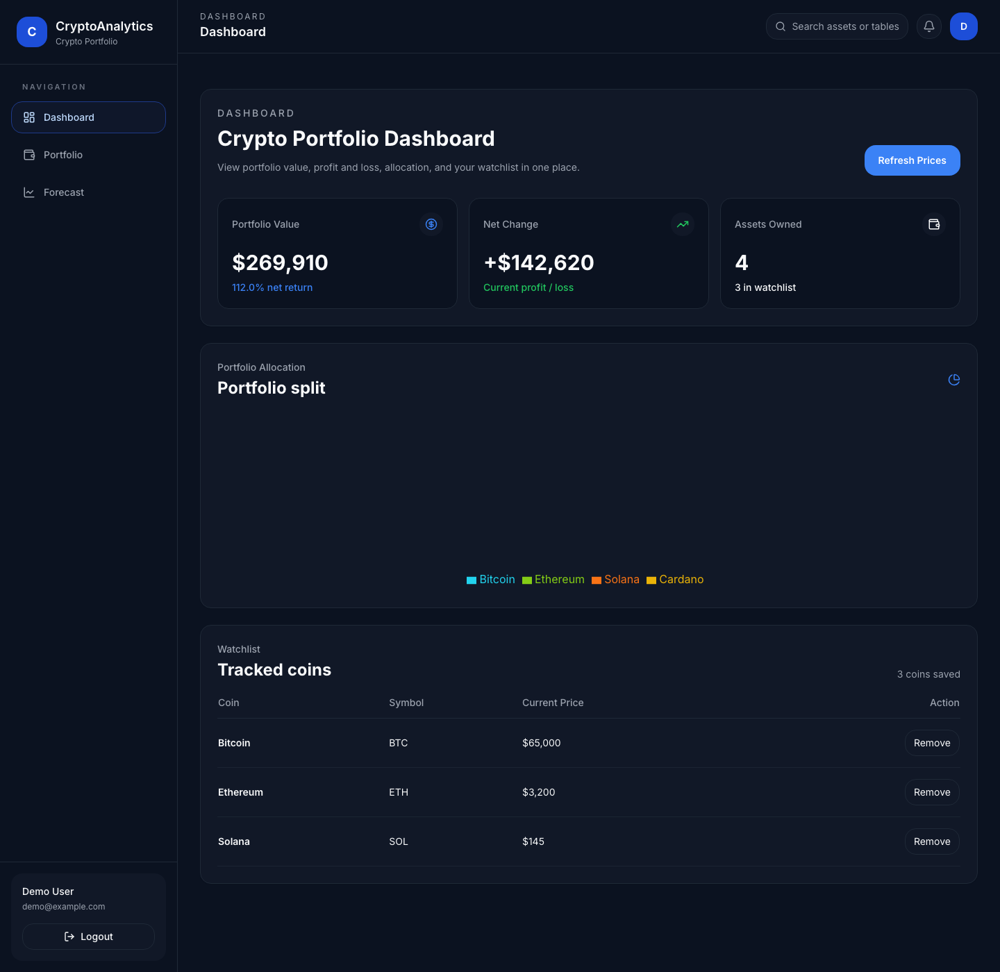
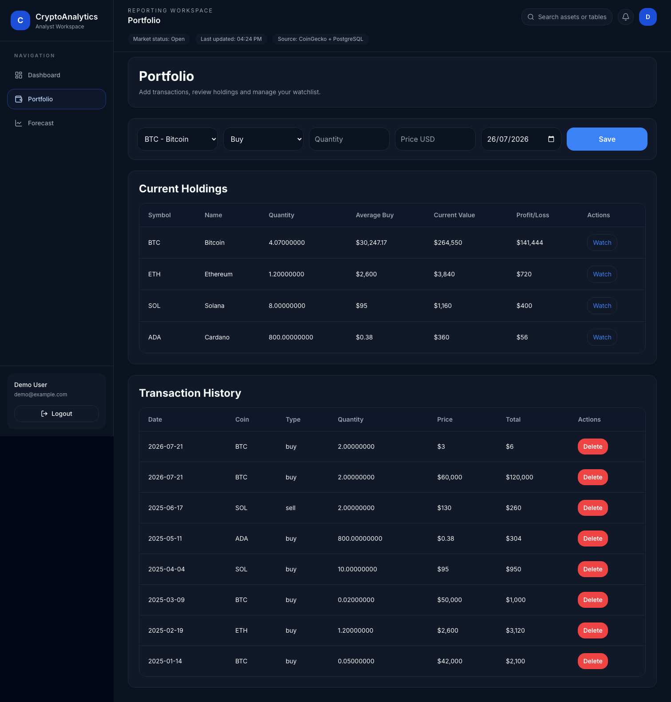
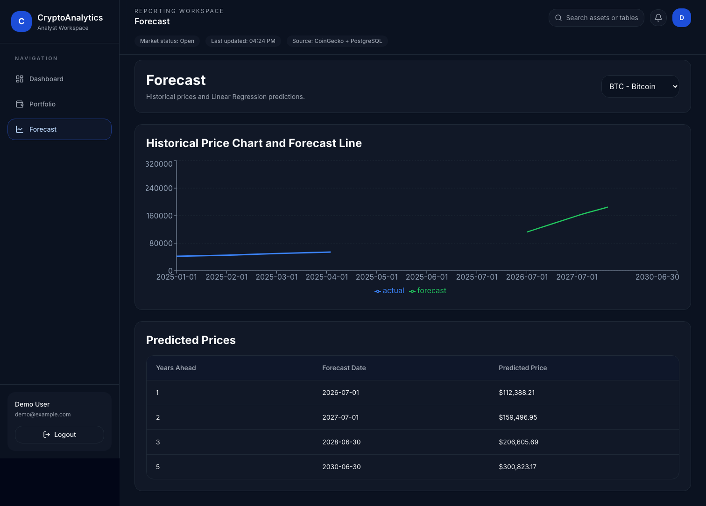
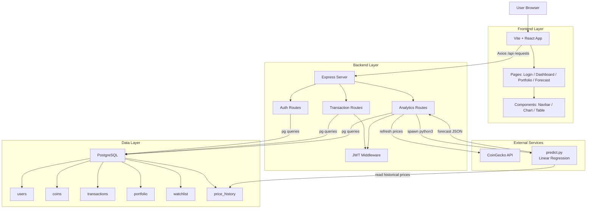

# Crypto Analytics


Crypto Analytics is a full-stack cryptocurrency portfolio tracking and forecasting project.

The project keeps the architecture intentionally simple:

- React frontend for the dashboard and portfolio UI
- Express backend for APIs
- PostgreSQL for data storage
- JWT authentication
- Python Linear Regression forecasting using `scikit-learn`
- JavaScript forecast fallback in the backend when Python is unavailable

## Preview

### Login


### Dashboard



### Portfolio



### Forecast



## Features

- User registration and login
- JWT-based protected APIs
- Create, view, and delete transactions
- Dashboard with portfolio value, profit/loss, assets owned, allocation, and watchlist
- Portfolio tracking
- Watchlist management
- Coin price refresh using CoinGecko
- Forecasting with historical data from PostgreSQL
- Automated backend tests

## Tech Stack

### Frontend

- React
- Vite
- CSS
- Axios
- Recharts
- React Router

### Backend

- Node.js
- Express.js
- `pg`
- JWT
- bcrypt

### Database

- PostgreSQL
- Raw SQL only

### Forecasting

- Python
- scikit-learn
- Linear Regression

## System Architecture



## How the App Works

### 1. Authentication

- A user registers or logs in from the frontend
- The backend stores hashed passwords using `bcrypt`
- On successful login, the backend creates a JWT token
- The frontend stores the token in `localStorage`
- Protected requests send the token in the `Authorization` header

### 2. Transactions

- A user adds a `buy` or `sell` transaction
- The transaction is stored in the `transactions` table
- After that, the backend recalculates the current holding in the `portfolio` table

### 3. Analytics

- The backend reads data from `portfolio`, `transactions`, `coins`, and `watchlist`
- SQL queries use `JOIN`, `SUM`, `AVG`, `COUNT`, and `GROUP BY`
- The frontend shows the results as cards, tables, and charts

### 4. Forecasting

- The frontend requests forecast data for a selected coin
- The Express backend first tries to run `forecast/predict.py`
- The Python script reads `price_history` from PostgreSQL
- It converts dates into numbers
- It trains a Linear Regression model
- If Python execution is unavailable on the host, the backend falls back to a simple regression calculation in JavaScript
- The API still returns the same historical data and prediction structure to the frontend


## Local Setup

## 1. Clone and install dependencies

```bash
git clone https://github.com/kritii10/CryptoAnalytics.git
cd CryptoAnalytics
npm install
```

## 2. Install Python dependencies

```bash
python3 -m pip install psycopg2-binary scikit-learn
```

## 3. Create PostgreSQL database

Create a database named:

```text
crypto_analytics
```

## 4. Add environment variables

This project reads values directly from `process.env`.

That means you should export these variables in your terminal before starting the backend:

```bash
export DB_HOST=localhost
export DB_PORT=5432
export DB_NAME=crypto_analytics
export DB_USER=your_postgres_user
export DB_PASSWORD=your_postgres_password
export JWT_SECRET=your_secret_key
```

If you want to use a real `.env` file later, you can add `dotenv`, but the current project keeps it simple and does not auto-load `.env`.

## 5. Run schema and sample data

```bash
psql -U your_postgres_user -d crypto_analytics -f database/schema.sql
psql -U your_postgres_user -d crypto_analytics -f database/sample_data.sql
```

## 6. Start the backend

```bash
npm run backend
```

The backend runs on:

```text
http://localhost:5050
```

## 7. Start the frontend

Open another terminal and run:

```bash
npm run frontend
```

The frontend runs on:

```text
http://localhost:5173
```

## Demo Login

The sample data includes a demo account:

- Email: `demo@example.com`
- Password: `password123`

## Available Scripts

- `npm run backend`
  - Starts the backend on port `5050`

- `npm run frontend`
  - Starts the Vite frontend

- `npm run build`
  - Builds the frontend for production

- `npm start`
  - Starts the Express server
  - If `frontend/dist` exists, it also serves the built frontend

- `npm run test`
  - Runs automated backend tests
